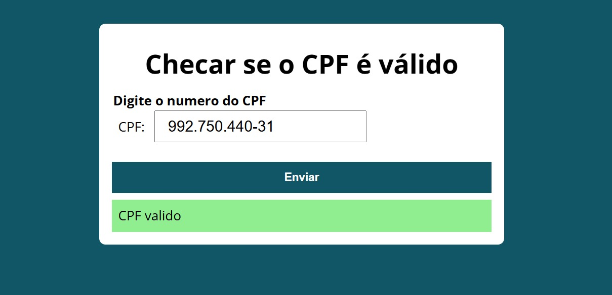
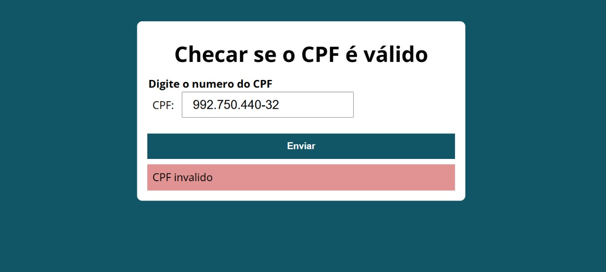

# 🪪 IsValidCPF

## 📌 Descrição
Projeto em **JavaScript** que valida números de **CPF** inseridos pelo usuário.  
O programa aplica o cálculo dos dígitos verificadores e retorna se o CPF informado é **válido** ou **inválido**.

> Este exercício foi feito para praticar lógica de programação e manipulação de strings/números em JavaScript.

---

## ⚙️ Funcionalidades
- Campo para o usuário inserir um número de CPF.
- Validação automática ao enviar:
  - Retorna **CPF válido** se os dígitos conferem.
  - Retorna **CPF inválido** caso contrário.
- Implementação baseada no cálculo oficial dos dígitos verificadores.

---

## 🛠️ Tecnologias utilizadas
- HTML5
- CSS3
- JavaScript (JS)

---

## 📸 Preview



---

## 🚀 Como visualizar

Você pode abrir o projeto localmente:

1. Baixe ou clone este repositório:
   - Clique em **Code > Download ZIP** e extraia os arquivos  
   - ou use o comando:
     ```bash
     git clone https://github.com/WellingthonSchuh/IsValidCPF.git
     ```

2. Abra o arquivo `index.html` em qualquer navegador moderno.

Ou

1. Acesse o site:
   - https://wellingthonschuh.github.io/isValidCPF/

> ⚠️ O projeto é totalmente seguro. Nenhum dado é armazenado — o cálculo é feito localmente no navegador.

---

## 📚 Aprendizados
- Manipulação de strings e arrays em JavaScript
- Uso de laços e condicionais para cálculos
- Implementação da lógica dos dígitos verificadores do CPF
- Validação de dados de entrada

---

## 👨‍💻 Autor
Feito por **Wellingthon Schuh**  
🔗 [LinkedIn](https://www.linkedin.com/in/wellingthonschuh)
